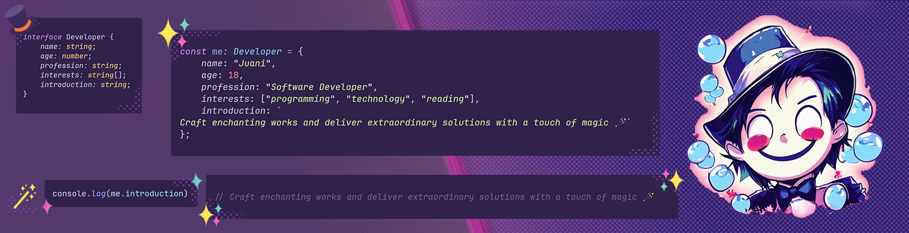

---

<h1 align="center">Hello! I'm Juan  Debandi👋</h1>

    <b>Welcome to my "About Me" section!</b>  

    
  

 

    <i>... and I’m a backend developer based in Mendoza, Argentina, crafting the backend solutions behind the web that you love to witness.   
        At present, my main area of focus is backend development, where I delve into the fascinating realms of JavaScript and databases, constantly honing my skills in this field. I started coding in high school and I'm largely self-taught in this field..  
        My academic background is primarily based on my self-taught approach and my recent graduation from a bootcamp at Coderhouse. Throughout my journey, I've completed various online courses to enhance my skills. The bootcamp provided me with hands-on training in programming and web development, keeping me very fresh and soaked in the latest technologies.  
        I’m willing to grow and challenge myself in environments where I can learn and keep creating amazing dynamic experiences that live on the internet. 
    </i>  

    
---

### 🧩 Languages & Tools

  <table align="center">
      <td align="center" width="100">
        
         JavaScript
      </td>
    <td align="center" width="100">
        
         TypeScript
      </td>
       <td align="center" width="100">
        
         Node.js
      </td>
    <td align="center" width="100">
        
         Nest.js
      </td>
     <td align="center" width="100"> 
        
         Express.js
      </td>
    </tr>
    <tr>
        <td align="center" width="100">
        
         MySQL
      </td>
    <td align="center" width="100">
        
         MongoDB
      </td>
    <td align="center" width="100">
        
         Jest
      </td>
<!--         <td align="center" width="100">
        
         GO
      </td>
     <td align="center"  width="100">
        
         Fiber
      </td> -->
        <td align="center"  width="100">
        
         Docker
      </td>
        <td align="center"  width="100">
        
         Postman
      </td>
    </tr>
     <tr>
<!--         <td align="center"  width="100">
        
         Angular
      </td>
        <td align="center"  width="100">
        
         RxJS
      </td> -->
         </td>
        <td align="center"  width="100">
        
         React
      </td>
      <td align="center"  width="100">
        
         Tailwind CSS
      </td>
      <td align="center" width="100">
        
         HTML
      </td>
      <td align="center" width="100">
        
         CSS
      </td>
         </tr>
  </table>

---

### ✨ Project Highlights:

    
    
    
    
    
    

---

### 🤹 My Stats:

    
    
    

