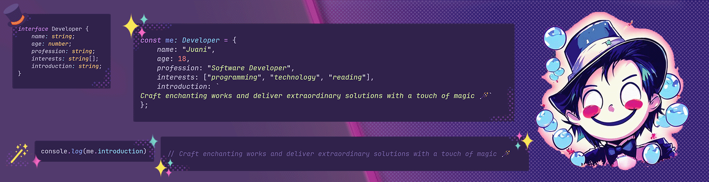

<!-- title name -->

 
    </a>

    
    
    
    

    <i>... and I’m a software engineer born in Mendoza, Argentina, specializing in crafting backend solutions that power the web experiences you enjoy.   
        My passion for technology started in high school, which led me to begin my coding journey right away. My academic background is self-taught, with skills honed through freelance work in backend and full-stack development. I continuously enhance my expertise through personal projects, staying current with the latest technologies...  
        I'm an empathetic and enthusiastic person who loves challenges and is always eager to learn something new. I take ownership of the projects I work on, ensuring the results are the best they can be.  
    </i>  

  

 
  
<h2>🧩 Languages & Tools</h2>

    

  

   
<h2>🤹 My Stats:</h2>

    
    

